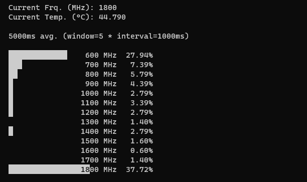

cpufrequi for raspberry pi
==========================



cpufrequi is a tool to display cpu clock averages over a chosen time window on a 
Raspberry Pi 4 Model B (https://www.raspberrypi.com/products/raspberry-pi-4-model-b/)
running a modern linux kernel that exposes the relevant files in sysfs (developed and tested on 5.10.x)

The data is obtained from

```
/sys/devices/system/cpu/cpu0/cpufreq/stats/time_in_state
```
see https://www.kernel.org/doc/Documentation/cpu-freq/cpufreq-stats.txt


It also displays the current clock according to

```
/sys/devices/system/cpu/cpufreq/policy0/scaling_cur_freq
```

Lastly, the current cpu temperature is read from

```
/sys/devices/platform/soc/soc:firmware/raspberrypi-hwmon/hwmon/hwmon1/device/hwmon/hwmon1/subsystem/hwmon0/temp1_input
```


MOTIVATION
==========

I enjoy benchmarking and inspecting performance metrics of computers. Some tools i usually use (see "other platforms") are not
available for the raspberry, and i couldnt really get a grip of how the CPU clocks behave under minor load.
Specifically, I used cpufrequi to compare the behavior of cpufreq governors "schedutil" and "ondemand" with various settings.


USAGE
=====

```
# cpufrequi -h
Usage of cpufrequi:
  -i int
        interval in ms (default 1000)
  -s int
        size of history (default 1000)
  -w int
        size of avg window (default 5)
```
For now, the history switch isnt useful. The idea is to be able to change the interval and window size at runtime in the future.
Right now you can only set it via flags when starting the program, so you would never need more history than the window size.
Setting the history size lower than the window size will crash the program :]


OTHER PLATFORMS
===============

TL;DR: use 
* https://linux.die.net/man/1/cpupower-monitor
* https://www.linux.org/docs/man8/turbostat.html
* https://github.com/lm-sensors/lm-sensors


In theory, cpufrequi could be used for any cpu platform supporting cpufreq-stats and hwmon.
In reality though, there are some things to consider:

* boost technology on modern AMD/Intel CPUs is not reflected in cpufreq-stats
* AMD/Intel CPUs use seperate clocks for each logical core

On systems with different clocks for each core, the tool just doesnt make sense in its current state.
You would really need an instance of the tool for each logical core, or have the tool
build some kind of average over all cores.

For these systems i suggest to use cpupower-monitor, which displays averages for cpu clocks per core
in the Mperf section and/or turbostat which displays a whole lot of stuff


